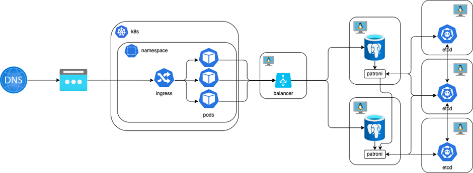
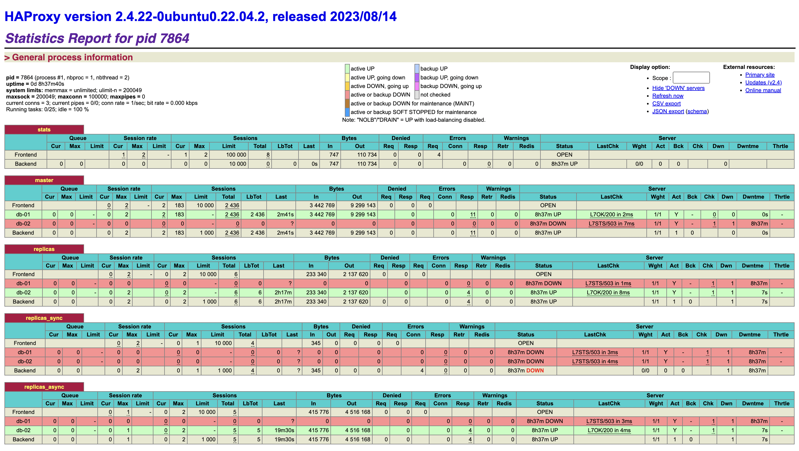

# Деплой кластера pg и приложения в k8s

## Задание



- Написать ansible playbook для развертывания postgresql в patroni сетапе. Пример, который можно взять за основу.
Разворачиваем etcd, patroni, postgres и единственный инстанс Haproxy.
- Написать helm chart для разворачивания api в выделенном неймспейсе. Docker image лежит в публичном registry, разворачивать стоит актуальную версию ghcr.io/ldest/sre-course/api
- Из образа вытащить скрипт миграции для создания БД, настроить на работу с кластером api, проверить работоспособность

Важно! Кластер k8s один на всех, ingress так же один, соответственно, и ip адрес внешний будет так же один.
Разделять запросы будем через доменные имена, которые можно указать либо в заголовке Host, либо в файле hosts – как вам удобнее. Не забывайте про ingressClassName: nginx


## Выполнение

### Деплой кластера pg

Для деплоя кластера использовался готовый ansible playbook. За основу был взят проект на github [vitabaks](https://github.com/vitabaks/postgresql_cluster).

В качестве управляющего хоста был выбран балансировщик. Все оперции по разворачиванию кластера pg выполнялись с этой VM с публичным IP.

#### Дополнения к ansible

1. Прописаны хосты в inventory.

2. В `envs` добавлен balancer в хочты pg_hba. Это необходимо прописать, иначе при отсутсвии балансера в контуре будет проблема с хостами в PG.

3. Не используется balancer.

#### Деплой

1. Проверить доступность хостов: `ansible all -m ping -i inventory`.

2. Выполнить playbook: `ansible-playbook -i inventory deploy_pgcluster.yaml`.

3. Скопировать файл `ansible/db/init.sql` на сервер БД и выполнить `psql -U postgres -a -f init.sql`.


### Деплой приложения в k8s

Для деплоя использовался helm. Для доступа к кластеру необходим файл конфигурации.

За основу взят стандартный helm chart.

#### Дополнения к helm chart

1. Переменная окружения `ConnectionStrings__PgConnection` необходимо для подключения к PG.

2. Переменная окружения `DOTNET_ENVIRONMENT` имеет 2 режима. В целях отладки используется `DEVELOPMENT`.

#### Деплой

1. Указать `ConnectionStrings__PgConnection` в `values.yaml`.

2. Выполнить: `helm install sre-course-api helm --kubeconfig=<path_to_config>`.


## Как проверить

#### Haproxy
Балансер торчит на 7000 порту, поэтому можно [посмотреть здесь](http://77.105.185.13:7000/stat).



#### K8S

Логи пода с пробами.
```
[17:49:56 INF] Executed endpoint 'Health checks'
sre-course-api-5bb4cbb584-mdbpp sre-course-api [17:49:56 INF] Request finished HTTP/1.1 GET http://100.70.142.22:80/healthz/ready - - - 200 - text/plain 0.3144ms
sre-course-api-5bb4cbb584-mdbpp sre-course-api [17:49:56 INF] Executed endpoint 'Health checks'
sre-course-api-5bb4cbb584-mdbpp sre-course-api [17:49:56 INF] Request finished HTTP/1.1 GET http://100.70.142.22:80/healthz/live - - - 200 - text/plain 2.6867ms
```

### API

Запрос для получения городов выполняется успешно - 200.
```
curl --location --request GET 'http://91.185.85.213/cities/' \
--header 'Host: weather-app.api'

[]
```

### Patroni

```
curl 10.0.10.3:8008/patroni

{"state": "running", "postmaster_start_time": "2023-10-08 09:06:29.266101+00:00", "role": "master", "server_version": 150004, "xlog": {"location": 117440512}, "timeline": 1, "replication": [{"usename": "replicator", "application_name": "db-02", "client_addr": "10.0.10.4", "state": "streaming", "sync_state": "async", "sync_priority": 0}], "dcs_last_seen": 1696787760, "database_system_identifier": "7287511460051207830", "patroni": {"version": "3.1.0", "scope": "postgres-cluster"}}
```

### etcd

Каждый инстанс etcd знает всё о каждом, поэтому достаточно зайти на любой etcd и выполнить `etcdctl member list -w table`.

```
etcdctl member list -w table
+------------------+---------+---------+-----------------------+-----------------------+------------+
|        ID        | STATUS  |  NAME   |      PEER ADDRS       |     CLIENT ADDRS      | IS LEARNER |
+------------------+---------+---------+-----------------------+-----------------------+------------+
| b586ded327f9460d | started | etcd-02 | http://10.0.10.6:2380 | http://10.0.10.6:2379 |      false |
| e1f06668267121f5 | started | etcd-03 | http://10.0.10.7:2380 | http://10.0.10.7:2379 |      false |
| e8cc3f7ff72fe07d | started | etcd-01 | http://10.0.10.5:2380 | http://10.0.10.5:2379 |      false |
+------------------+---------+---------+-----------------------+-----------------------+------------+
```
