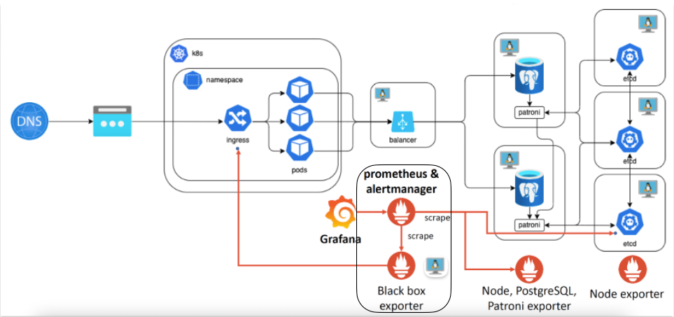
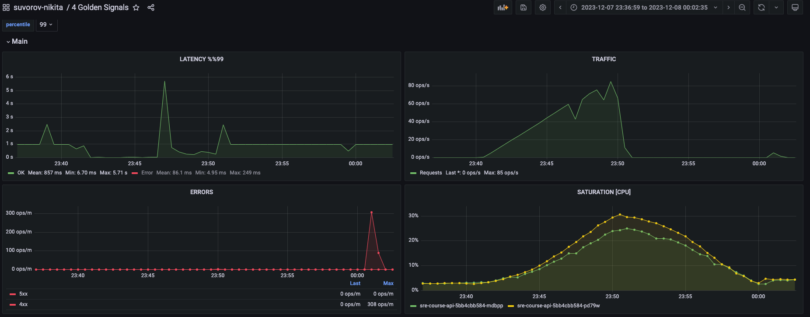
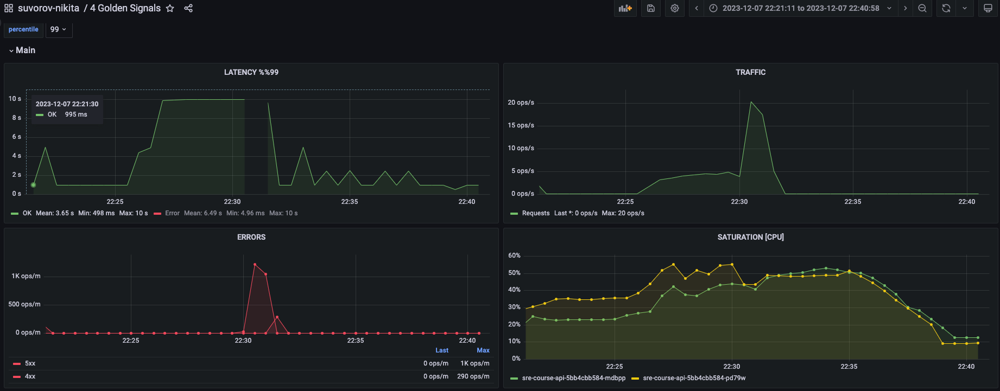

# Нагрузочное тестирование

## Задание

1. Разработать профиль нагрузки для системы
2. Реализовать профиль на любом инструменте НТ (разработать скрипт)
3. Задать нефункциональные требования по производительности к системе (SLO/SLA)
4. Найти максимальную производительность системы
5. Написать краткий вывод: где достигнута максимальная производительность, где узкое место в системе, для подтверждения привести графики.

## Выполнение

### Схема системы


### Описание
Поскольку исследуемое приложение разрабтано специально для курса и мы не имеем продуктового описания системы и 
исторических данных, то дальнейшее НТ будет выполнено на введённых нами предположениях.

Предположим, что старания не напрасны и наша приложение погоды в дальнейшем будет использоваться диспетчерами
в каждом аэропорте РФ. Это объясяет потребность в высокой доступности приложения.

### Задать нефункциональные требования по производительности к системе (SLO/SLA)

#### SLA
Всего в РФ существует 86 эаропортов. Предположим что в каждой смене в каждом аэропорте деспетчеров не больше 50.

Бизнес подписал договор, по которому необходимо обеспечить выполнение `SLA = 99.95`. Время получения прогноза на текущий момент
времени должно быть не дольше `1m`. Предположим, что обновление происходит 1 раз в 5 минут `± 20 RPS`.

Как поставщик данных наша компания обязуется производить обновление информации с датчиков каждую минуту. Предположим, что 
наши супер чувствительные приборы должны быть расположены в каждом городе.

#### SLO
Мы как техническая команда выставляем `SLO = 99.99`.

Поскольку наша цель соблюдать SLO, то опишем nfr по каждому эндпоинту.
Описание NFR для API приложения:
```
# Получение города интересует, если только потом 
# получаем и прогноз по этому городу.
GET /cities/${id}
latency = 1m
rps = 10 RPS
error = [5xx]

# В нашем бизнес сценарии очень редко используется 
# обновление города. В рассмотрение не берём.
PUT /cities/${id}

# Предполагаем, что список городов тоже отдельно не получаем. Поскольку
# список очень редко меняется, то храним его в кеше клиента с ttl = 24h.
GET /cities

# В нашем бизнес сценарии очень редко используется 
# обновление города. В рассмотрение не берём.
POST /cities

# Предполагаем, что использование напрямую зависит от GET /cities/${id}, потому что в
# бизнес сценарии уходит на бек 2 асинхронных запроса. Тогда требования схожи.
GET /forecast/${id}
latency = 1m
rps = 10 RPS
error = [5xx]

# В нашем бизнес сценарии очень редко используется 
# обновление города. В рассмотрение не берём.
PUT /forecast/${id}
latency = 500ms
rpm = 
error = [5xx]

# В нашем бизнес сценарии очень редко используется 
# обновление города. В рассмотрение не берём.
GET /forecast
latency = 500ms
rpm = 
error = [5xx]

# Является внутренней ручкой, в которую поступают данные со всех приборов в разных городах.
POST /forecast
latency = 1s
rps = 5 RPS
error = [5xx]

# Основной эндпоинт, который является публичным и имеет наибольшую нагрузку. Каждый оператор раз в 5 мин
# получает актуальный прогноз.
GET /WeatherForecast
latency = 1m
rps = 20 RPS
error = [5xx]
```

### Разработать профиль нагрузки для системы

В рамках тестирования нас интересует провести следующие тесты:
1. Capacity - анализируем максимальную производительность системы при увеличении операция получения прогноза и города.
2. Capacity - анализируем максимальную производительность системы при увеличении датчиков погоды.
3. Capacity - анализируем максимальную производительность системы при увеличении запросов прогноза погоды.

#### 1. Getting page for city with forecast [Capacity]
При анализе максимальной производительности повышаем нагрузку 
на операции получения прогноза погоды и города. Эмулируем ситуацию при которой пользователь асинхронно делает 2 запроса
за данными при открытии прогноза погоды для конкретного города.



Из графиков видно, что максимальное значение удовлетворяющее SLO: `RPS = 60, Latency <= 1s`.

Промежуточный вывод:
Из графиков видно, что время ответа начинает уменьшаться при увеличении запросов. Поскольку всего в БД 170 городов для теста,
то делаем предположение о наличии хеша. Такая реализация может стать узким местом в случае частой инвалидации кеша и 
объёмной БД.

#### 2. Adding forecast [Capacity]


#### 3. Getting WeatherForecast [Capacity]
Ручка получение прогнозов погоды может использоваться отдельно от остальных эндпоинтов приложения. Поэтому
интересно понять какое максимальное количество RPS может выдерживать endpoint и как изменится при этом время ответа.

Для этого выполняем capacity тестирование.




Из графиков заметна прямолинейная зависимость времени ответа от количества запросов.
Максимальное значение удовлетворяющее SLO: `RPS = 5, Latency = 10s`. При целевой показатель по этой ручке
не достяжим.

Промежуточный вывод:
При подаче нагрузки время ответа сильно возрастает и из графиков видно, что увеличивается загрузка CPU.
Делаем предположение, что прогноз для построения прогноза погоды необходимы вычислительные мощности. Как улучшение - можно
предагрегировать данные для построения прогноза, что позволит сократить время вычисления.

### Написать краткий вывод: где достигнута максимальная производительность, где узкое место в системе, для подтверждения привести графики.

Самая тяжёлая операция в приложении - получение прогноза погоды, которая напрямую зависит от количество прогнозов и количества городов.
Это подтверждается графиками и возможное улучшение - сделать секционирование по регионам, так же добавить хранение предагрегированных
данных, чтобы снизить время ответа ручки. Помимо этого стоит добавить алерты на потребление CPU, поскольку данный запрос быстро утилизирует мощность процессора.

Получение городов является быстрой операцией, поскольку препложительно используется кеширование и с увеличение количества запросов наблюдается
снижение времени ответов. Но открытым остался вопрос как поведёт себя кеш при увеличении базы городов и инвалидации кеша, которая 
может выполняться при обновлении.

