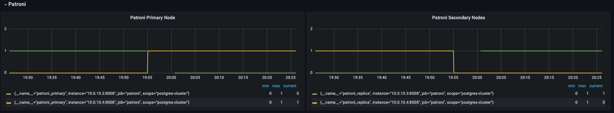
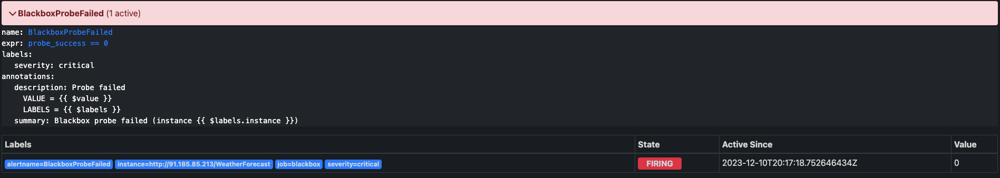
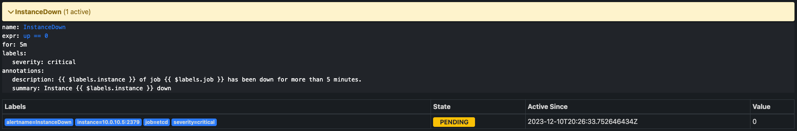

# Chaos engineering

## Задание

1. Отключение узла: Планово остановить один из узлов кластера, чтобы проверить процедуру
   переключения ролей (failover). - Анализировать время, необходимое для восстановления и как
   система выбирает новый Master узел (и есть ли вообще там стратегия выбора?).
2. Имитация частичной потери сети: Использовать инструменты для имитации потери пакетов
   или разрыва TCP-соединений между узлами. Цель — проверить, насколько хорошо система
   справляется с временной недоступностью узлов и как быстро восстанавливается репликация.
3. Высокая нагрузка на CPU или I/O: Запустить процессы, которые создают высокую нагрузку на CPU или дисковую подсистему одного из узлов кластера, чтобы проверить, как это влияет на
   производительность кластера в целом и на работу Patroni.
4. Тестирование систем мониторинга и оповещения: С помощью chaos engineering можно также
   проверить, насколько эффективны системы мониторинга и оповещения. Например, можно
   искусственно вызвать отказ, который должен быть зарегистрирован системой мониторинга, и
   убедиться, что оповещения доставляются вовремя ?

Если сделали все предыдущие:
1. ”Split-brain": Одновременно изолировать несколько узлов от сети и дать им возможность
   объявить себя новыми мастер-узлами. Проверить, успеет ли Patroni достичь
   консенсуса и избежать ситуации "split-brain".
2. Долгосрочная изоляция: Оставить узел изолированным от кластера на длительное время, затем восстановить соединение и наблюдать за процессом синхронизации и
   восстановления реплики.
3. Сбои сервисов зависимостей: Изучить поведение кластера Patroni при сбоях в сопутствующих сервисах, например, etcd (которые используются для хранения состояния кластера),
   путем имитации его недоступности или некорректной работы.


## Описание

### Схема системы


Объекты системы:
 - 3 ноды etcd;
 - 2 ноды patroni/pg;
 - 1 нода haproxy;
 - 1 нода prometheus/alertmanager.

## Выполнение

### Отлючение узла

Описание эксперимента:

Отключение `master` узла patroni. Анализируем состояние кластера PG. 
Анализируем доступность сервиса - запросы на запись и на чтение выполняются без ошибок.

Отключение выполняем с помощью команды:
```
sudo systemctl stop patroni.service
```

Ожидаемые результаты:

При выключении `master` узла patroni происходит переключение `replica->master`.
Ошибки при выполнении запросов на чтение и обновление данных не появляются.
Возвращение узла приводит к тому, что `master` не меняется, а новый узел становится `replica`.

Реальные результаты:

При выключении `master` узла patroni происходит переключение `replica->master`. Это хорошо заметно на графиках.
По времени восстановления видно, что само переключение занимает около минуты.



Запросы к API выполнились без ошибок.

Анализ результатов:

В результате эксперимента доказано опытным путём, что фактический результат соответсвует ожидаемому.
Переключение `replica->master` выполняется успешно и не влияет на доступность БД. Есть небольшой лаг во время переключения.
Интересно провести нагрузочное тестирование и посмотреть на каком количестве запросов это будет критично.

### Имитация частичной потери сети

Описание эксперимента:

Имитируем потерю пакетов. Проверяем какое влияние оказывает потеря пакетов на `replica`.
В качестве инструмента используем `blade`.

Имитируем потерю пакетов с помощью команды:
```
blade create network drop --source-port 5432 --network-traffic out --timeout 300
```

Ожидаемые результаты:

Ошибки при выполнении запросов на чтение и обновление данных не появляются. Приложение работает корректно.
При восстановлении `replica` догоняет `master`.

Реальные результаты:

Запросы на чтение и обновление данных выполняются без ошибок.

После восстановлениея `replica` догнала `master` менее чем за 1m. В качестве операций для тестирования выполнялись
запросы на создания новых прогнозов погоды через k6.


Анализ результатов:

Потеря пакетов по сети не оказывает влияние на доступность сервиса, что соответсвует ожидаемому результату.
Восстановление `master` происходит менее чем за 1m. Инетересно провести данный эксперимент с большой продолжительность и
более объёмными изменениями, для выявления динамики скорости восстановления реплики.


### Высокая нагрузка на CPU или I/O

Описание эксперимента:

Имитируем высокую нагрузку CPU. Анализируем сайд эффекты на части системы.

`stress-ng --cpu 1 --cpu-method matrixprod --metrics --timeout 120`

Ожидаемые результаты:

Узел с patroni и pg работает без ошибок. Отсутствуют проблемы с доступностью pg.

Реальные результаты:

Доступность pg ухудшилась. Утилизация CPU оказала влияние на время обработки запроса.


Анализ результатов:

Ожидаемые и реальные результаты не совпали. В гипотезе не подразумевалось ухудшение работы pg, но в
ходе эксперимента это оказалось следствием после уменьшения доступности ресурса CPU. Поскольку это
критично, то стоит добавить тригер в alermanager и threshold в grafana, чтобы заметить схожую ситуацию в будущем.


### Тестирование систем мониторинга и оповещения

Описание эксперимента:

Проверка системы мониторинга. Моделируем ситуацию при которой происходит срабатывание алерта и проверям на сколько
быстро информация об этом появится в alermanager.

Ожидаемые результаты:

При выключении инстанса haproxy срабатывает alert `BlackboxProbeFailed`, но тригер срабатывает не моментально.
При отключении инстанса etcd ожидаем срабатывание `BlackboxProbeFailed`.

Реальные результаты:

Отключаем инстанс haproxy и [анализируем alermanager](http://91.185.84.54:9090/alerts?search=) на появление новых активных триггеров.
Отключение haproxy в `20:16:51`, срабатывание тригера `BlackboxProbeFailed` в `20:17:18`.


Отключаем инстанс etcd и [анализируем alermanager](http://91.185.84.54:9090/alerts?search=) на появление новых активных триггеров.
Отключение haproxy в `20:26:02`, срабатывание тригера `BlackboxProbeFailed` в `20:26:33`. Тригер в состоянии `PENDING`.



Анализ результатов:

Тригеры срабатывают, не совсем как ожидалось. Если инстант не доступен, то только через 5 мин мин сработает триггер о
недоступности, что может быть критично для доступности продукта.

### ”Split-brain"

### Долгосрочная изоляция

#### Сбои сервисов зависимостей
